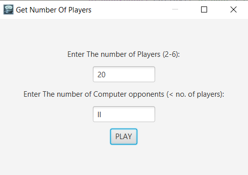
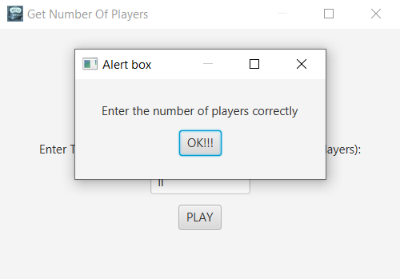
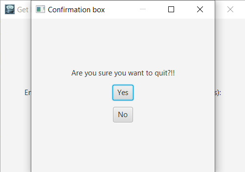
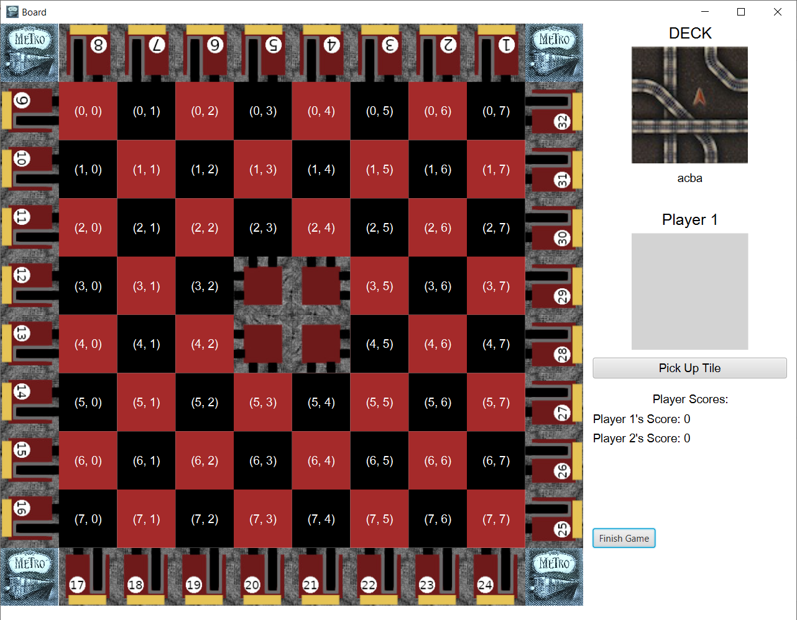
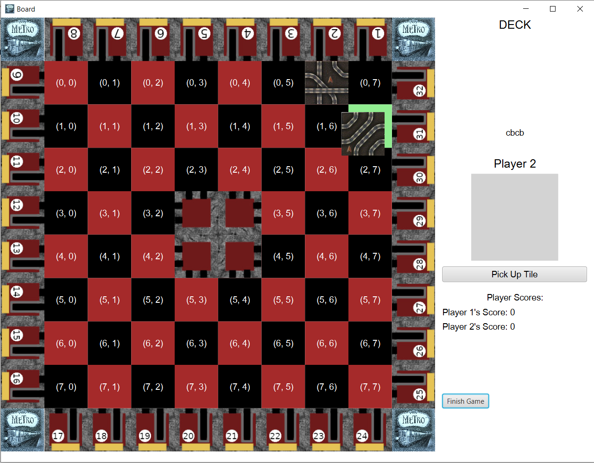
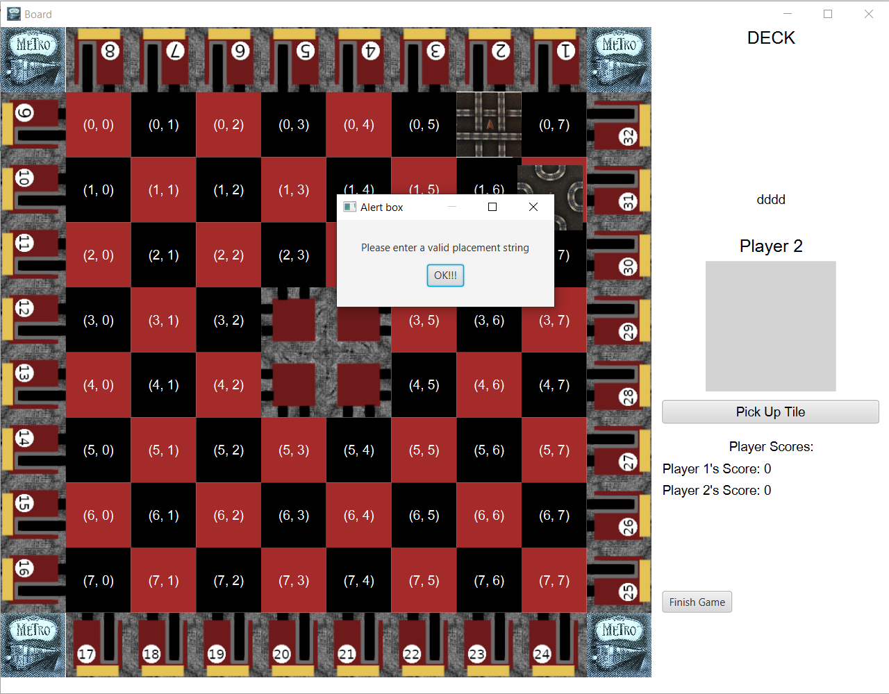
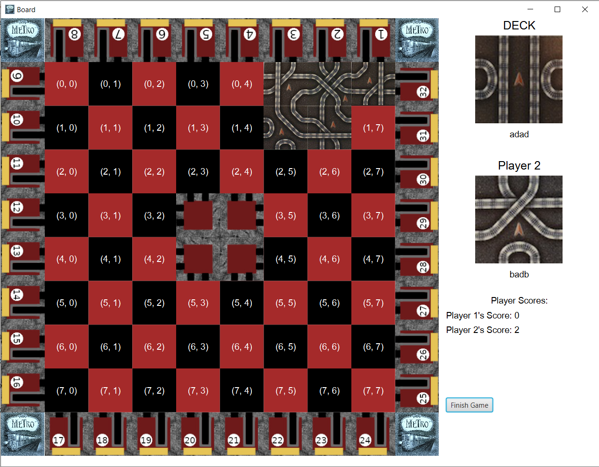
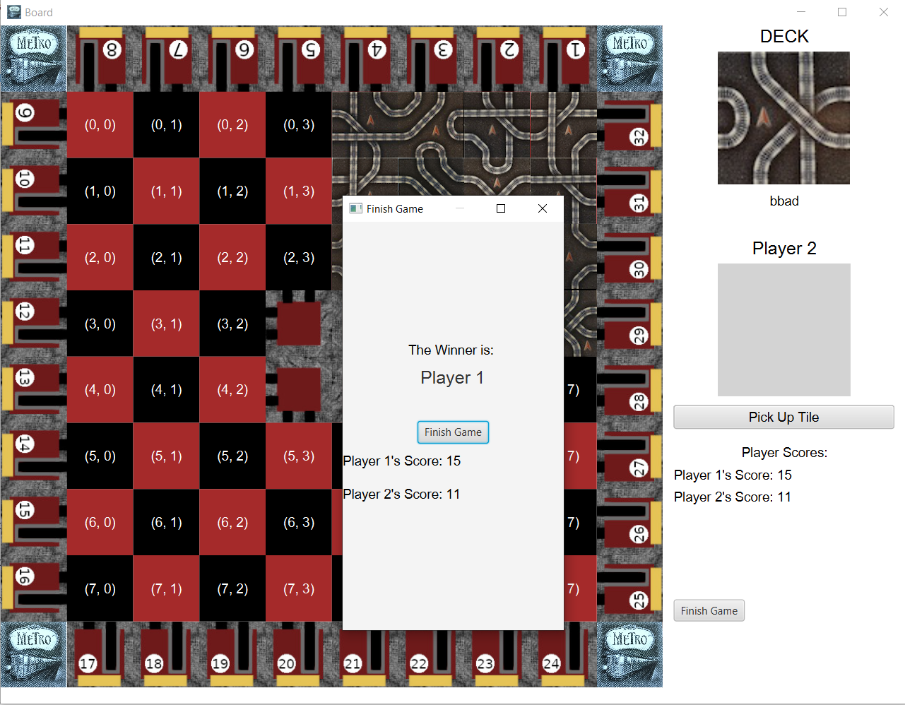

# Metro Board Game

## Motivation

This game was part of my assignment which I implemented in my first semester of 2020 at Australian National University. 
It was a group project, although over here I have redesigned the project so that I don't use the work done by my teammates as my own.

The Problem Description can be seen first which was given by the university. Followed by the screenshots of the actual game.

## Problem Description

In this project I have implemented a tile placement game called [*Metro*](https://www.ultraboardgames.com/metro/game-rules.php),
made by games developer Dirk Henn and published by [Queen Games](https://ssl.queen-games.com/en/start_en/) in Java, using JavaFX. 
[Board Game Geek provides a description of Metro](https://boardgamegeek.com/boardgame/559/metro), including images of the components.

### Rules

Metro is a game for 2-6 players, who take turns placing tiles.
First, the deck is shuffled so that the tiles are drawn in a random order.
Each player starts with an empty hand.

On their turn, a player draws a tile (if they do not currently have one in their hand), then they place the tile on the board.
If they do not wish to place the tile, they may pick up another tile from the deck *which they must place immediately*.
On their following turn, they have the option to place the tile in their hand, or again draw from the deck. 
On any given turn, if a player chooses to draw from the deck when they *already have a tile in their hand*,
they *must place the tile that they draw*.

There are four conditions that must be followed when laying down tiles:

* Each tile must be placed on a square adjacent to another tile or the edge of the board.
  A tile may not be placed next to one of the central station tiles unless it is also adjacent to another tile.
* Tiles cannot be rotated.
* A tile may be placed against any other player's metro line or station. 
* A tile may not be placed so that it connects two stations (or loops back to the same station) with a track of length 1, unless there is no other valid way to place this tile (this rarely occurs). 

The game ends when all tiles have been placed.
The winner is decided by scoring completed tracks - see [Scoring](#scoring).

The image below shows invalid placements that may occur.
The tile in the top-left corner is invalid because it completes a track from station 9 with a length of 1.
The tile in the top-right corner is invalid because it loops from station 6 back to itself, when there are other options available for placement.
The tile in the bottom-centre is invalid because it does not connect to any other tile or the edge of the board.

The following image demonstrates *valid* loops from a station back to itself.
Note the invalid loops traverse only one tile, while the valid loops traverse more than one tile.

### Board

Tiles are placed on a board of 8x8 squares, labelled 0-7 across the rows and columns.
Each square is labelled `(row, column)` or equivalently `(y,x)`.
Around the edges of the board are *stations*, which are numbered 1 to 32 starting in the top right corner and continuing anticlockwise.
Which edge stations belong to each player depends on the number of players in the game; the station arrangements for 2-6 players
are as follows:

- 2 players:
  - player 1 owns 1, 3, 5, 7, 9, 11, 13, 15, 17, 19, 21, 23, 25, 27, 29, 31
  - player 2 owns 2, 4, 6, 8, 10, 12, 14, 16, 18, 20, 22, 24, 26, 28, 30, 32
- 3 players:
  - player 1 owns 1, 4, 6, 11, 15, 20, 23, 25, 28, 31
  - player 2 owns 2, 7, 9, 12, 14, 19, 22, 27, 29, 32
  - player 3 owns 3, 5, 8, 10, 13, 18, 21, 24, 26, 30
- 4 players:
  - player 1 owns 4, 7, 11, 16, 20, 23, 27, 32
  - player 2 owns 3, 8, 12, 15, 19, 24, 28, 31
  - player 3 owns 1, 6, 10, 13, 18, 21, 25, 30
  - player 4 owns 2, 5,  9, 14, 17, 22, 26, 29
- 5 players:
  - player 1 owns 1, 5, 10, 14, 22, 28
  - player 2 owns 6, 12, 18, 23, 27, 32
  - player 3 owns 3, 7, 15, 19, 25, 29
  - player 4 owns 2, 9, 13, 21, 26, 30
  - player 5 owns 4, 8, 11, 20, 24, 31
- 6 players:
  - player 1 owns 1, 5, 10, 19, 27
  - player 2 owns 2, 11, 18, 25, 29
  - player 3 owns 4, 8, 14, 21, 26
  - player 4 owns 6, 15, 20, 24, 31
  - player 5 owns 3, 9, 13, 23, 30
  - player 6 owns 7, 12, 22, 28, 32

There are also four stations located in the centre of the board at coordinates `(3,3), (3,4), (4,3), (4,4)`.
These belong to no player, but double the score of any line that ends at them.

The image below shows the layout of the board, including the label of each square.

### Tiles

Tiles have 8 exits, starting with 0 in the top-left corner and continuing clockwise as shown below.
Each even-numbered exit connects to an odd-numbered exit.

Every tile is represented by a four-character string. 
Each character is a letter between 'a' and 'd', denoting the **orientation of the
tracks leading from even-numbered exits on each side of the tile**, starting at exit 0 and moving clockwise.
More specifically,

* 'a' denotes a straight track;
* 'b' denotes a track that turns 90º to the neighbouring edge clockwise;
* 'c' denotes a track that turns 90º to the neighbouring edge counter-clockwise; and,
* 'd' denotes a track that turns 180º i.e. loops back to the same edge.

The image below shows the tile 'cbaa', which has a track from exit 0 that turns counter-clockwise to join exit 7, a track from exit 2 that turns to clockwise to join exit 5, a straight track from exit 4 to exit 1, and a straight track from exit 6 to exit 3.

There are 60 tiles in total, with 2-4 copies of each tile as follows: 
* **4 copies** of tiles `aacb`, `cbaa`, `acba`, `baac`, and `aaaa`;
* **3 copies** of tiles `cbcb` and `bcbc`; and,
* **2 copies** of all remaining tiles: `cccc`, `bbbb`, `dacc`, `cdac`, `ccda`, `accd`, `dbba`, `adbb`, `badb`, `bbad`, `ddbc`, `cddb`, `bcdd`, `dbcd`, `adad`, `dada` and `dddd`.

Individual images of each tile can be found in `src/gui/assets`.

### Tile Placements

A *tile placement* string is a six character string, the first four characters of which represent a [tile](#tiles).
The final two characters are digits between 0 and 7 denoting the row and column of the tile (in that order).
For example, the tile `cccc` in row 3, column 2 would be labelled `cccc32`. 

A *placement sequence* string is a concatenation of up to 60 tile placement strings, representing all tiles that have been placed so far in a game.

### Scoring

Any metro lines that start at a player's station and end at a station score points. 
A player scores 1 point *for each tile the metro line crosses.* If a metro line crosses a tile *more than once*, then the player
scores 1 point for *every time that line crosses the tile.* If a line ends at one of the central stations,
the points for that line are doubled. 

For example: In the image below, the yellow player scores 19 points on station 11.
(Remember tracks can finish at any station, this one just happens to loop back to itself).

## Screenshots and Game Play

### Get Players
Initially the game asks for the number of players and the relative number of AI players they want.
There is validation applied on the entry boxes for the specified limit, so the user can enter whatever he/she wants and depending on it the programs raises an error.
For example, if we enter some wrong values like the figure given below, then it will raise an appropriate error message.

The same is applied for the next box for the number of computer component.
If the User wants to quit the game before starting the game, then a confirmation box appears to confirm this decision.

 

### Game Board and Game Play

Based on the number of players, it allocates the station numbers as seen in the rules.

#### The Board
The board is divided in two parts, where on the right side the current player's name and the tile in his/her hand is shown with the tile on *top of the deck*.
On the bottom side, we have the scores updating after each move for each player.
There is a button at the end to end the game in between without wait for all the tile to be over.

On the Left side is the board itself. 

#### Player Moving Tile
The player can pick and drag the tile across the board. If the location is valid for that tile placement, then the block appears green in color.

If the players tries to place the tile on any location where the tile cannot be placed according to the rules then the game shows an error message.

#### Player Picking Up Tile
A player can pick up a tile and move another tile from the *top of deck*. This can be done with the help of the button `Pick Up Tile`. 

#### Finishing The Game
The scores for each player is updated with every move that is made. This helps in keeping track of each players score in real time.
The players can also finish the game prior to its ending with the help of `Finish Game` button at the end.
When they press the `Finish Game` button then the Final Score screen apprears with the winners name and the scores for all players. 

### Thank You
This was a fun experience, and I learned a lot from this project and from my other teammates.
They helped me understanding different aspects of the game.

My teammates: 
- Tom Stephens
- Kyle Robertson
